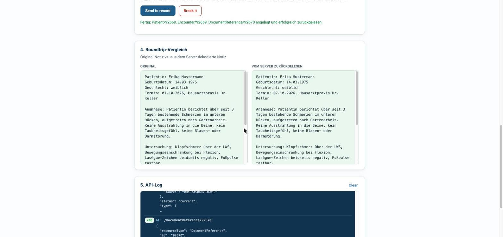
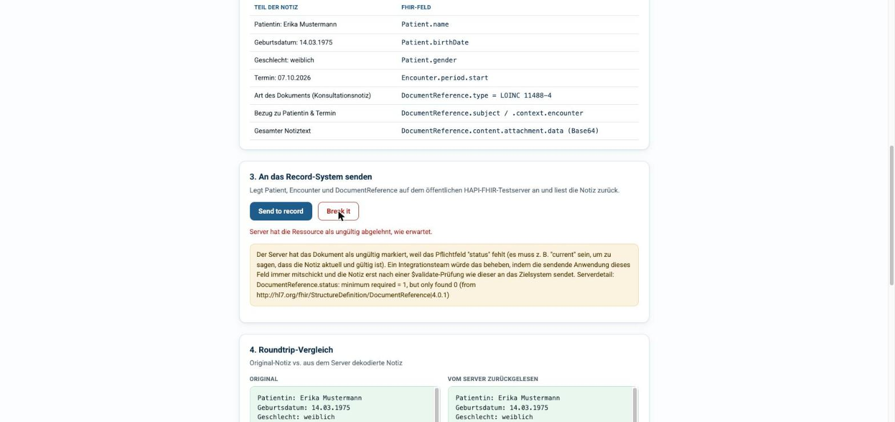

# Note to Record

**Live demo:** open `index.html` on GitHub Pages — no install, no login, no build step.

## What this shows

An AI scribe writes a consultation note after a doctor's visit; a records integration has to turn that note into structured data the practice's system understands. This demo takes a short, made-up German consultation note and sends it to a public test [FHIR](https://www.hl7.org/fhir/) R4 server as a `Patient`, an `Encounter`, and a `DocumentReference` carrying the note text. It then reads the `DocumentReference` back from the server and shows it next to the original to prove the round trip worked byte-for-byte. A "Break it" button also sends a deliberately invalid resource so you can see what a rejected integration call looks like and how a team would fix it.

Everything happens directly from the browser to [hapi.fhir.org/baseR4](https://hapi.fhir.org/baseR4), a public HL7 test server — there is no backend, no database, and no real patient data.

## The mapping

| Part of the note | FHIR field |
|---|---|
| Patientin: Erika Mustermann | `Patient.name` |
| Geburtsdatum: 14.03.1975 | `Patient.birthDate` |
| Geschlecht: weiblich | `Patient.gender` |
| Termin: 07.10.2026 | `Encounter.period.start` |
| Document type (consult note) | `DocumentReference.type` = LOINC `11488-4` |
| Link to patient & visit | `DocumentReference.subject` / `.context.encounter` |
| Full note text | `DocumentReference.content.attachment.data` (base64) |

## Screenshots

**Round trip** — note sent, stored, and read back unchanged:

**Break it** — an invalid resource, and what the server says about it:

## What would change in production

- **Authentication** through SMART on FHIR (OAuth 2.0) instead of an open, anonymous server.
- **German FHIR profiles**, such as ISiK, instead of plain base R4 resources.
- **Validation against the target system's profile before sending**, not just a generic `$validate` call against base FHIR.
- **Logging and monitoring per partner system**, since every record system fails slightly differently and an integration team needs to see that per connection, not just in a browser console.

## A note on the "Break it" button

The public HAPI test server doesn't enforce FHIR's required fields on a plain `POST` — it will silently accept a `DocumentReference` missing its required `status` field. To show a real rejection, "Break it" calls the server's `$validate` operation instead, which does run FHIR's structural rules and returns an `OperationOutcome` flagging the missing field. That gap between "the server will store it" and "the server considers it valid" is itself a small, realistic lesson about integration testing: a permissive test server is not the same as a conformant one.

## Out of scope

User accounts, a database, AI-generated notes, and any real patient data.
